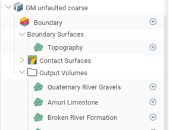

import SchemaUri from '@theme/SchemaUri';
import FlatProperties from './_generated/flatmd/objects/geological-model-meshes-2.1.0.md';

# geological-model-meshes

<SchemaUri uri="schema/objects/geological-model-meshes/2.1.0/geological-model-meshes.schema.json" />

A collection of one or more meshes from a geological model, organized by folder. Volumes are represented as a triangular mesh hull, surfaces as a triangular mesh surface. Volumes and surfaces may reference a material. Only geology and its associated properties are expected in a geological-model-meshes object.

## `folders` *array*

Each folder contains a list of items that can recursively reference other folders, volumes or surfaces. Folders collect and categorize meshes like a directory tree. The folder structure can be used to provide an organizational hierarchy to volumes and surfaces in a way understandable by the consumer.

  

### `volumes` *array*

A list of volumes. Each volume consists of one or more connected triangle mesh parts creating a closed hull.

Each volume contains:

* `name`: Object name

* `description`: Optional field for adding an additional description about this object.

* `quality`: Optional hint about mesh [Quality](components/mesh-quality) characteristics that provide guarantees about the mesh.

* `parts` : list of mesh parts that make up this volume, and a flag if traversal order within the part is reversed.

* `material_key`: Optional associated material. The key is a unique identifier to a material in the materials list.

* `feature`: Kind of geology feature represented by this volume. Can be one of
  - "Void"
  - "OutputVolume"
  - "Vein"
  - "VeinSystem"

### volume_attributes

Attributes associated with each volume. Attribute tables have one row per volume.

### `surfaces` *array*

A list of surfaces. Each surface consists of one or more connected triangle mesh parts representing a continuous surface.

Each surface contains:

* `name`: Object name

* `description`: Optional field for adding additional description about this object.

* `quality` : Optional hint about mesh [Quality](components/mesh-quality) characteristics that provide guarantees about the mesh.

* `parts` : list of mesh parts that make up this volume, and a flag if traversal order within the part is reversed.

* `material_key`: Optional associated material. The key is a unique identifier to a material in the materials list.

* `feature`: Kind of geology feature represented by this surface. Can be one of
  - "Fault"
  - "ContactSurface",
  - "Topography",
  - "BoundarySurface",
  - "StratigraphicContactSurface"

### surface_attributes

Attributes associated with each surface. Attribute tables have one row per surface.

## triangle_geometry

A set of triangulated mesh parts in 3D space. [Parts](../understanding-schemas/understanding-parts) (mesh subsections) can be defined in a way that can be shared between adjacent volumes and surfaces.

* `triangles`: The vertices and triangle indices of the mesh. Triangles are defined by triplets of indices into a vertex list.

* `parts` : An array where each entry is a reference to a chunks of mesh triangles. Parts are in turn composed together to represent volumes and surfaces.

    Volumes and surfaces can share parts. We do this to encourage conformal meshes that exactly abut adjacent meshes. Using shared parts makes it easier to validate if a set of meshes are conformal.

    (needs work)

    

    The part index is an index into "chunks" of vertices. If a polygon, the vertices represent a closed sequence. Each "chunk" has a set of vertices that are a member of that chunk.

* `Reversed` allows the same Part to be shared by multiple volumes/surfaces. The flag indices the direction of traversal of the vertices so may be swapped when traversed from an adjacent object.

* `Chunks` may contain a set of indices to handle non-contiguous storage.

    If indices are missing (Contiguous case):
    - Each chunk is an offset/count range of sequential vertices in the vertices table.

    If indices are defined
    - The chunk offset/count points to a range of indices in the indices table. Each index in the indices table points to vertices.

## `materials` *array*
 [Materials](components/material) referenced by volumes and surfaces.

## Properties

<FlatProperties />

::mermaid[_generated/uml/geological-model-meshes-2.1.0.mmd]
